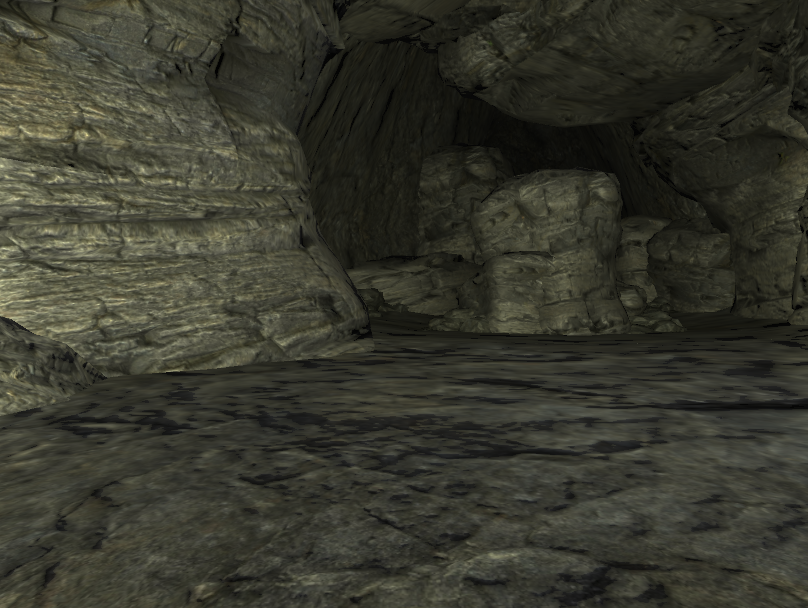
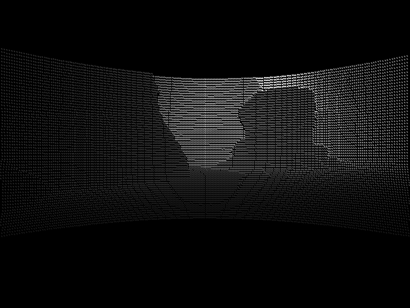
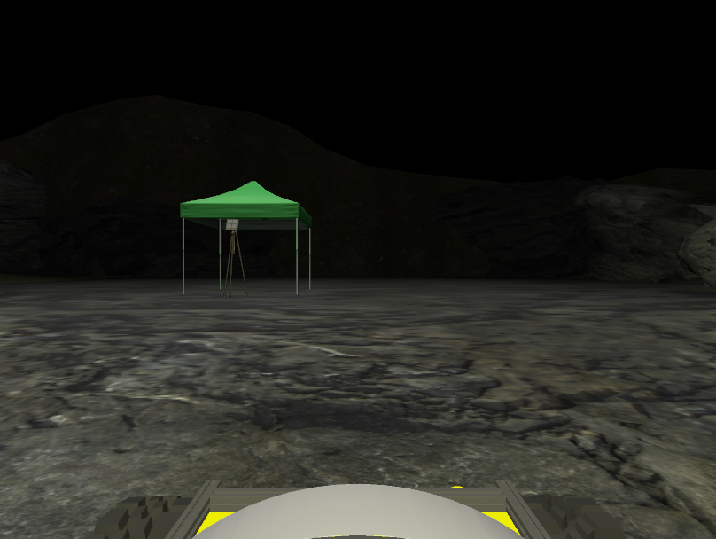
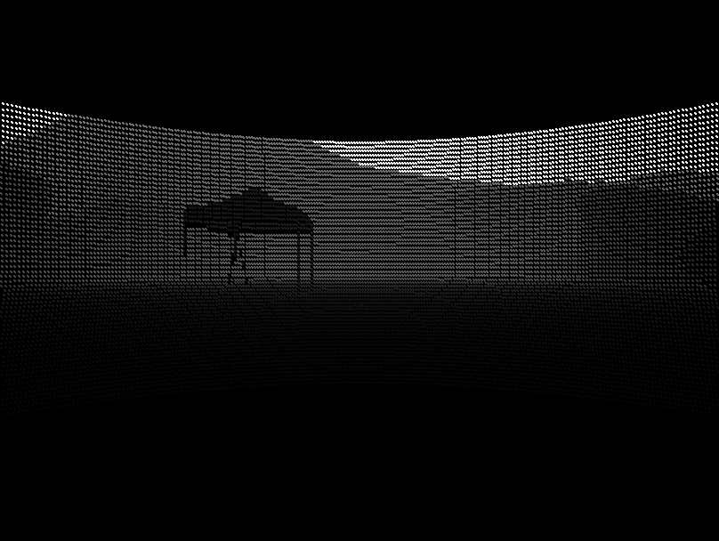

# lidar2depth
A ROS node to convert lidar point cloud bag to depth image

Example use:
```
rosrun lidar2depth lidar2depth_node points:=/X1/points/ camera_info:=/X1/front/optical/camera_info
```
The node publishes an image topic `/depth_image` containing a `uint16` image.

The camera_info topic must contain an optical frame, that is, 

> 1. origin of frame should be optical center of camera
> 2. +x should point to the right in the image 
> 3. +y should point down in the image 
> 4. +z should point into the plane of the image  
> [Source: CameraInfo](http://docs.ros.org/en/melodic/api/sensor_msgs/html/msg/CameraInfo.html)

Otherwise the transforms for projecting the pointcloud into the image plane will be incorrectly oriented.

## Depth encoding
The depth values of the image use the same encoding as the KITTI dataset

> How the depth map is encoded in KITTI data:
 Depth maps (annotated and raw Velodyne scans) are saved as uint16 PNG images,
 which can be opened with either MATLAB, libpng++ or the latest version of
 Python's pillow (from PIL import Image). A 0 value indicates an invalid pixel
 (ie, no ground truth exists, or the estimation algorithm didn't produce an
 estimate for that pixel). Otherwise, the depth for a pixel can be computed
 in meters by converting the uint16 value to float and dividing it by 256.0:
>
> ```
> disp(u,v)  = ((float)I(u,v))/256.0;
> valid(u,v) = I(u,v)>0; 
> ```
> [Source: KITTI DevKit](https://github.com/joseph-zhong/KITTI-devkit/blob/master/readme.md)

## Examples

For enhanced visualization, set 

```
rosparam set visualize true
```

This makes every lidar point project to a 3x3 pixel patch instead of a single pixel and scales the depth values to the full image range.

Different cameras will project the same lidar points to a different perspective

For example, the same point cloud, but different cameras were used for the following examples.

```
rosrun lidar2depth lidar2depth_node points:=/X1/points/ camera_info:=/X1/front/optical/camera_info
```

 


```
rosrun lidar2depth lidar2depth_node points:=/X1/points/ camera_info:=/X1/rear/optical/camera_info
```


 


